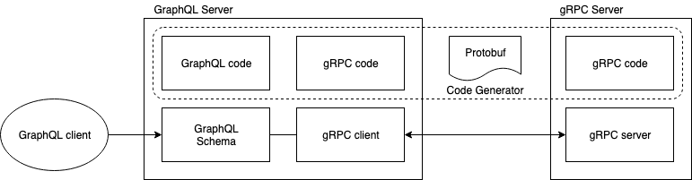

# graphql-grpc-edge

This repo is an **EXPERIMENTAL** work to automatically generate graphql server
as aggregate server to serve gRPC backed service.

## Background

gRPC and GraphQL are application level communication protocol designed to solve different set of problems. Both gRPC and GraphQL using different serialization and specification but shares same characteristics and functionalities as listed below.

Same specification characteristics between protobuf to grphql schema:

|  Protobuf   | GraphQL                                    |
|-------------|--------------------------------------------|
|  Package    | N/A                                        |
|  Service    | N/A                                        |
|  Import     | N/A                                        |
|  Enum       | Enum                                       |
|  Oneof      | Union                                      |
|  Message    | Type                                       |
|  Field      | Field                                      |
|  RPC        | `Query` or `Mutation`                      |
|  RPC Input  | `InputObject` with `option (graphql.type)` |
|  RPC Output | `Object` with `option (graphql.type)`.     |

Same primitive serialization data types:

| Protobuf | GraphQL. |
|----------|----------|
| uint8    | Int      |
| uint16   | Int      |
| uint32   | Int      |
| uint64   | Int      |
| int8     | Int      |
| int16    | Int      |
| int32    | Int      |
| int64    | Int      |
| float32  | Float    |
| float64  | Float    |
| string   | String   |
| bool     | Boolean  |

## Goals

Create a tool to get the best of both worlds. gRPC is very helpful to develop backend service. With gRPC, API contracts can be described concisely and also code implementation can be autogenerated. Unfortunately, as of this repository is created, there is no easy way to use gRPC directly from web browsers for web application. On the otherhand, GraphQL is very popular on web frontend community thanks to its flexible query fields resulting in efficient network transfer size, and graph-like data representation very helpful for frontend engineer. One of the downsize of using GraphQL is there's no easy way to generate a GraphQL schema.

It is possible to create a GraphQL server and schema to be used by frontend engineer while communicating to backend services using gRPC to return the results. But to do this manually will be very tedious.

## Design



## Usage

1. Install `protoc-gen-graphql` executable with `go get github.com/ncrypthic/graphql-grpc-edge/protoc-gen-graphql`.

2. Import `graphql-grpc-edge/graphql/graphql.proto` protobuf file.

3. Add `graphql.type` option to `service.rpc`(s) to generate graphql operation type (Query, Mutation) along with the operation name. For example:

    ```proto
    syntax="proto3";

    // ...
    import "graphql-grpc-edge/graphql/graphql.proto";

    // ...
    service Example {
        rpc GetSomething(GetSomethingRequest) returns(GetSomethingResponse) {
            option (graphql.type) = {
                // this will generate a graphql query named `getSomething` with `GetSomethingRequestInput` as its parameter
                // and `GetSomethingResponse` object as its return type
                query: "getSomething"
            };
        }

        rpc MutateSomething(MutateSomethingRequest) returns(MutateSomethingResponse) {
            option (graphql.type) = {
                // this will generate a graphql mutation named `mutateSomething` with `MutateSomethingRequest` as its parameter
                // and `MutateSomethingResponse` object as its return type
                mutation: "mutateSomething"
            };
        }
    }
    ```

5. Generate golang code using `protoc --graphql_out=:. file.proto`

6. Register generated graphql types, queries and mutations. Using example generated code from proto definition above:

    ```golang
    import (
        "github.com/graphql-go/handler"
        edge "github.com/ncrypthic/graphql-grpc-edge/graphql"
    )

    // ...
    // grpcClient: grpcClient to upstream gRPC server

    somePackage.RegisterExampleServiceTypes()
    somePackage.RegisterExampleServiceQueries(grpcClient)
    somePackage.RegisterExampleServiceMutations(grpcClient)

    gqlSchema := edge.GetSchema()
    ```

7. Serve the graphql schema

    ```golang
    import (
        "github.com/graphql-go/handler"
        edge "github.com/ncrypthic/graphql-grpc-edge/graphql"
    )

    // ...

    somePackage.RegisterExampleServiceTypes()
    somePackage.RegisterExampleServiceQueries(grpcClient)
    somePackage.RegisterExampleServiceMutations(grpcClient)

    gqlSchema := edge.GetSchema()
    h := handler.New(&handler.Config{
        Schema:   schema,
        Pretty:   true,
        GraphiQL: true,
    })

    http.HandleFunc("/graphql", func(w http.ResponseWriter, req *http.Request) {
        // Optional: enable opentracing
        span, ctx := opentracing.StartSpanFromContext(context.Background(), "entrypoint")
        defer span.Finish()
        // Handle graphql API
        h.ContextHandler(ctx, w, req)
    })
    ```

## More example

See [example](example)


## License

MIT License

Copyright (c) 2019 Lim Afriyadi

Permission is hereby granted, free of charge, to any person obtaining a copy
of this software and associated documentation files (the "Software"), to deal
in the Software without restriction, including without limitation the rights
to use, copy, modify, merge, publish, distribute, sublicense, and/or sell
copies of the Software, and to permit persons to whom the Software is
furnished to do so, subject to the following conditions:

The above copyright notice and this permission notice shall be included in all
copies or substantial portions of the Software.

THE SOFTWARE IS PROVIDED "AS IS", WITHOUT WARRANTY OF ANY KIND, EXPRESS OR
IMPLIED, INCLUDING BUT NOT LIMITED TO THE WARRANTIES OF MERCHANTABILITY,
FITNESS FOR A PARTICULAR PURPOSE AND NONINFRINGEMENT. IN NO EVENT SHALL THE
AUTHORS OR COPYRIGHT HOLDERS BE LIABLE FOR ANY CLAIM, DAMAGES OR OTHER
LIABILITY, WHETHER IN AN ACTION OF CONTRACT, TORT OR OTHERWISE, ARISING FROM,
OUT OF OR IN CONNECTION WITH THE SOFTWARE OR THE USE OR OTHER DEALINGS IN THE
SOFTWARE.
